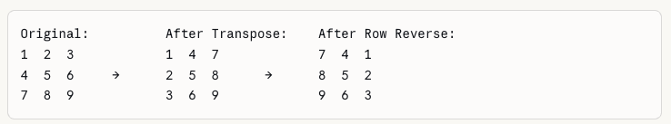
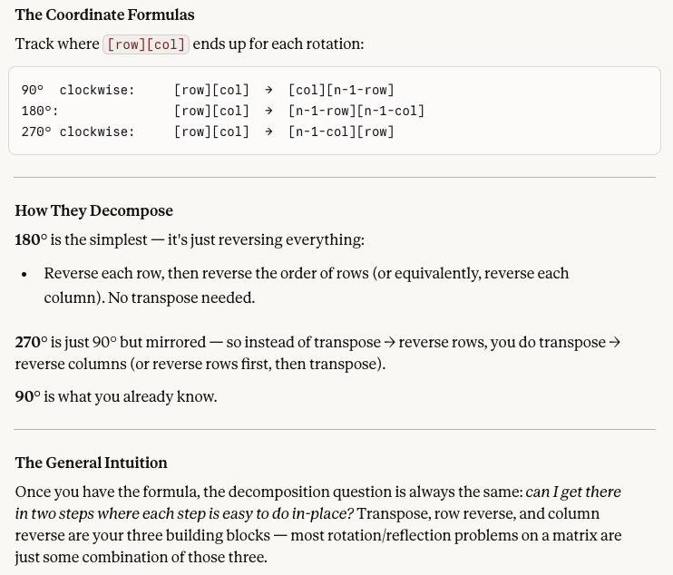

## Arrays and Objects Problems

### 48. Rotate Image (LeetCode)

- **Strategy:** **transpose** (flip over imaginary diagonal from top left to lower right), then **reverse rows.** 
- **This version** only calls for **rotating 90 degress.** (Others like the Visa algo, for ex., calls for 180 and 270 degree rotations too...).
- Variable to store matrix length (easier reading), nested for loops to traverse rows (outer) and columns (inner)
    - `temp` variable used to re-assign values in place (per the prompt)
    - by **transposing** (swapping) values in this way, you get the row values put into columns; however, they're not yet in the right place
- Final loop **reverses** the rows (the rows *now* where the values were just swapped), which places them into their correct column position



```js
var rotate = function(matrix) {
  // variable for reuse/readability
    const n = matrix.length;
    // outer loop for traversing the rows
    for (let row = 0; row < n; row++) {
      // inner loop looks at columns (values in nested arrays)
        for (let col = row + 1; col < n; col++) {
            // value swapping in place
            // this transposes them across the diagonal
            let temp = matrix[row][col];
            matrix[row][col] = matrix[col][row];
            matrix[col][row] = temp;
        }
    }

    for (let row = 0; row < n; row++) {
        matrix[row].reverse();
    }
};
```

- RE: extensions of this problem (e.g., like **Visa** take-home where function took additional args, including other rotations like 180, 270 degrees). Per Claude:




### 242. Valid Anagram (LeetCode, **Structy.net** version below)

- Traditional JS Objects
    - iterate over characters of s1, create a hash map to count chars and their frequencies
    - iterate over s2, decrement count in the hash map for characters that match
    - iterate over hash map; valid anagram if all chars have a zero count
    - early returns for false in loop over s2 and last/third loop over hash map; final return is true (a valid anagram has been found)
    - Time: O(n). Space: O(n)

```js
const anagrams = (s1, s2) => {
  const count = {};
  for (let char of s1) {
    if (!(char in count)) {
      count[char] = 0;
    }
    count[char] += 1;
  }
  
  for (let char of s2) {
    if (count[char] === undefined) {
      return false;
    } else {
      count[char] -= 1;
    }
  }
  
  for (let char in count) {
    if (count[char] !== 0) {
      return false;
    }
  }
  
  return true;
};
```

- Using Map for hashing (**Structy**)
    - edge case check for unequal string lengths, early false return
    - instantiate `hash` map for frequency counts for s1 chars
    - first loop --- think of as collecting inventory
    - second loop over `s2` --- think of as spending inventory
        - early return for any char that doesn't appear (not an anagram)
        - update the count by decrementing chars that do appear
        - less than zero check --> if **s2 has any char that is overused compared to in s1**, also cause for **early return**
        - if this **loop runs fully**, then **both strings have same chars and frequencies** --> they are valid anagrams
    - Time: O(n). Space: O(n)

```js
const anagrams = (s1, s2) => {
  if (s1.length !== s2.length) return false;

  const hash = new Map();

  for (const char of s1) {
    hash.set(char, (hash.get(char) || 0) + 1);
  }

  for (const char of s2) {
    if (!hash.has(char)) return false;

    hash.set(char, hash.get(char) - 1);

    if (hash.get(char) < 0) return false;
  }

  return true;
};
```