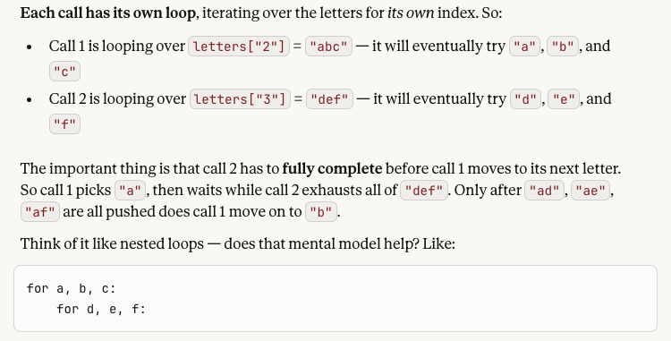
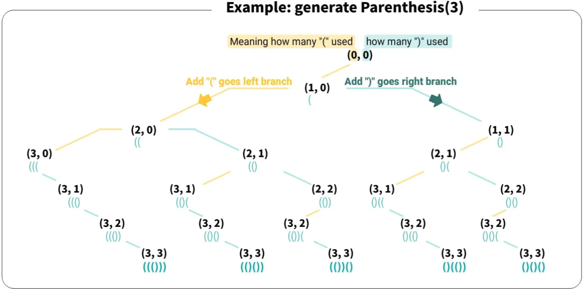
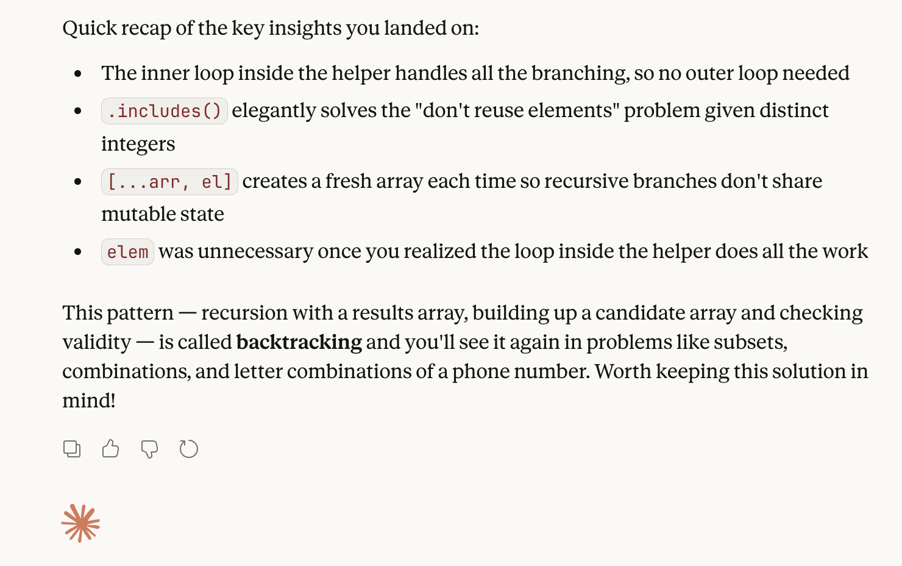
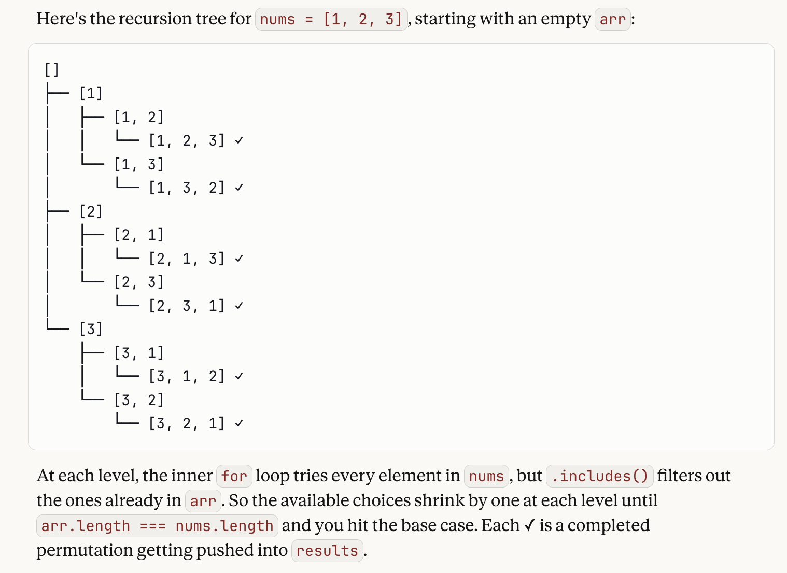

## Recursion / Backtracking / DFS

- **General Advice:**
- Look these signals in a prompt:
    - **"Find all combinations/subsets/permutations"** — almost always backtracking
    - **"How many ways can you..."** — often recursion, sometimes Dynamic Programming
    - The solution space is a tree of choices — if you can phrase the problem as "at each step I choose X or Y", backtracking fits
    - **You need to explore and then undo** — if committing to a choice temporarily and reversing it later makes sense, that's the push/pop pattern (e.g., #39 Combination Sum)
- For **recursion problems specifically**, do this step **between** pseudocode and coding:
        - **Draw** the tree first. Seriously, on paper.
        - Before writing a single line of code, ask:
            - What is **one "decision"** at **each step**?
            - What **changes** between recursive calls?
            - What does the **base case(s)** look like?


### 17. Letter Combinations of a Phone Number

- **Recursion** and generating combos (similar to #22 Generate Parentheses)
- Dictionary for the `letters` that go with each digit of a phone keypad; initialize a `result` array to return (per the prompt), combos will be pushed into this
- **Recursive helper**
    - Core idea is to build out combinations as you iterate over the letters for each digit (e.g., with "23", you start with "a" and make combos like "ad", "ae", af", then move onto "b" and form "bd", "be", "bf", etc.)
    - **Base case** is when the combo's length reaches that of digits' length; push into result array at this point and return
    - **KEY:** the `for...of` loop iterates over each char/letter of the string that has the letters for the current digit
        - Args for the recursive helper: `combo` being built, `index` (which gets incremented by 1 with every call, to access subsequent chars/letters, and `nums` (digits for clarity/differentiating the original arg passed into the main function))
        - Each call (execution context) has its own loop, iterating over the letters for its own index. See below, per Claude:
    
- Edge case of 1 digit is handled by the function naturally

```js
var letterCombinations = function(digits) {
    // edge case --- if digits is less than 2; return an empty array, as no combos are possible
    // recursion naturally handles edge case of 1 digit (it creates single-letter 'combos', if you will)
    
    const letters = {
        "2": "abc",
        "3": "def",
        "4": "ghi",
        "5": "jkl",
        "6": "mno",
        "7": "pqrs",
        "8": "tuv",
        "9": "wxyz"
    }

    const result = [];

    const recursiveHelper = (combo, index, nums) => {
        // base case --- when combo length is as long as the length of digits
        if (combo.length === digits.length) {
            result.push(combo);
            return
        }
        // loop --- each char of the string for each digit
        for (const char of letters[nums[index]]) {
            recursiveHelper(combo + char, index + 1, nums)
        }
    }

    recursiveHelper('', 0, digits);

    return result;
};
```


### 22. Generate Parentheses

- See HH 2/11/2025
- Backtracking / DFS using **recursion** --- explores a "decision tree" of all possible parenthesis placements, building the solution incrementally
    - Prunes branches (backtracks) as soon as an invalid state is reached (e.g., more closing parentheses than opening ones, or too many total parentheses)
    - Recall: the opening and closing of execution contexts (that sense of moving "down" and "up" the tree branches) 
- Recursive helper func that builds string each time func is called recursively, decrementing left or right variables to take us from n to 0, and pushes string into results when there are no more parentheses to add
    - Note that our two recursive cases are non-exclusive, which allows us to keep generating all possible strings
    - We only add in `“)”` when the number of existing `“(”` exceeds the number of `“)”` in the current string
    - Every time **both conditionals pass**, we **branch** off into **separate new string permutations** (new "tree")
- Time: O(4^n / √n). Space: O(4^n / √n).

```js
var generateParenthesis = function(n) {
    // initialize empty results array
    const results = [];

    // helper function --- params are string (starts as empty, concat parens with recursive calls), left parens (#), right parens (#)
    // no return value, results array just gets populated with a finished combo of parens (string) prior to ending
    const generate = (str, l, r) => {
        // base case --- when there aren't any more right parens, then the combo if finished
        if (r === 0) {
            results.push(str);
            return;
        }
        // recursive call --- while there are left parens, call the helper with a left parens concatenated to string
            // decrement left by 1 (you've "used" one left parens in constructing the combo)
        if (l > 0) generate(str + '(', l - 1, r);
        // recursive call --- while there are more right than left parens, concat a right parens to the combo string
            // decrement right by 1 (you've used a right parents in building out the combo)
        if (l < r) generate(str + ')', l, r - 1);

        }
    // initiates the recursive sequence
    generate('', n, n);
    return results
};
```




### 39. Combination Sum

- Approach: **backtracking/DFS** using **recursion.** Builds out a decision tree (think Felipe's HH solutions with recursion, "take it or leave it" saying).
- Must see if nums added together add up to target
- Also, if a single num from `candidates` itself X amount of times can add up to the `target`, as well as if multiple nums in `candidates` add up to `target`
- Wrinkle: unlimited # of uses for an elem in the `candidates` array (i.e., a number can be reused any # of times to add up to the target potentially).
    - One series of recursive calls needs to deal specifically while **staying at the same index**
    - Another series of recursive calls handles building combos while **moving the index forward**

```js
var combinationSum = function(candidates, target) {
    const result = [];

    const comboMaker = (index, combo, total) => {
        // base case (success) --- if total sum equals target, push combo into result and return
        if (total === target) {
            // spread operator here --- must push a copy, so as not to mutate the original array
            result.push([...combo]);
            return;
        }
        // base case (failure) --- if sum total exceeds target or if index goes beyond length of candidates array, then early return (no combo pushed)
        if (total > target || index >= candidates.length) {
            return;
        }

        // add current candidate to the combo array
        combo.push(candidates[index]);
        // this recursion occurs staying at same index; addresses the "same num can be used unlimited times" part of prompt
        comboMaker(index, combo, total + candidates[index]);
        // backtrack by undoing the push --- i.e., like trying another branch
        combo.pop();
        // recursion at the next index
        comboMaker(index + 1, combo, total);
    }

    // invoke comboMaker function to start recursion
    comboMaker(0, [], 0);
    // after recursion and population of result array, return it
    return result;
};
```


### 46. Permutations

- **Backtracking/recursion.**
- Similar to Rock-Paper-Scissors---recursion helps with the building out of combinations once you hit a base case, move "back"/"up" the branches (i.e., closing execution contexts), etc.
- But **different** because the **nums** array can vary in size!!!
- **KEY:** within the **recursive helper function**, which has an empty array and nums passed in on the first initial call that triggers the recursive sequence, there is a **loop** which will process each element of the array.
    - the `.includes` method helps with adding an element to the perm array being built if it's not there already
    - the **spread operator** ensures each recursive call & its execution context gets the proper/correct snapshot of the array permutation being built
        - see **Claude snapshots below**
    - intially, my thought was a loop outside the helper with the recursive call inside, but this resulted in repetitious permutations (incorrect)
- Dialogued with Claude:




- **NOTE:** use your favorite online compiler to do a walkthrough with recursion problems to "see" it. :D

```js
var permute = function(nums) {
    // initialize an array to populate w/ perms
    const results = [];
    
    // recursive helper --- function that will build out permutation arrays, to be pushed into results
    const recursiveHelper = (arr, numbers) => {
        // base case --- when perm array is same length as nums array (i.e., a full perm has been made)
        // push the perm array that has been created
        if (arr.length === nums.length) {
            results.push(arr);
            return;
        };
        // loop over elems in nums array
        // recursively call the helper if current elem isn't in perm arr being built
            // pass a copy of the array---gives each call/execut. context its own snapshot of the perm array as it "branches" out
            // also adds el to it, building out the perm
        for (const el of numbers) {
            if (!arr.includes(el)) {
                recursiveHelper([...arr, el], numbers);
            }
        }
    }

    // // recursive call --- empty array for the perm, and nums to iterate over inside the helper
    recursiveHelper([], nums);

    // return perm-populated results array
    return results;
};
```


### 70. Climbing Stairs

-  **Recursion** with **Fibonacci sequence** (i.e., the next sum is the sum of the two preceding nums). This increases the possible number of combos with the option of either 1 or 2 "steps" to climb.
- **KEY**: utilizing memoization (closure!) to avoid timing out and too many redundant calls (see in-line notes)
    - closure means subsequent calls (e.g., calling with the same argument after it's already been called once and the result has been stored in the cache) will be much faster, passes the remaining test cases

```js
var climbStairs = function(n) {
    const cache = {};

    const recursiveFunct = (num) => {
        // check cache first --- early return if result is stored
        if (cache[num] !== undefined) return cache[num];
        
        // base cases
        if (num === 0) return 0;
        if (num === 1) return 1;
        if (num === 2) return 2;
        
        // compute the value --- recursive calls set up for a Fibonacci sequence
            // the two calls generate the "tree" for recursion & backtracking
            // store in cache, which the helper has access to because of closure
        cache[num] = recursiveFunct(num - 1) + recursiveFunct(num - 2);
        // returns either the stored value or the result of the recursion (if function is being called with whatever n is for the first time)
        return cache[num];
    }
    return recursiveFunct(n);
};
```
