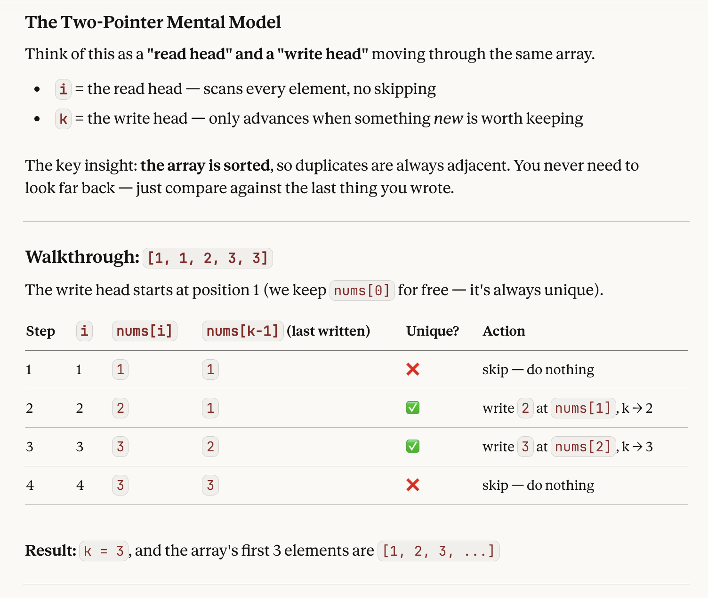
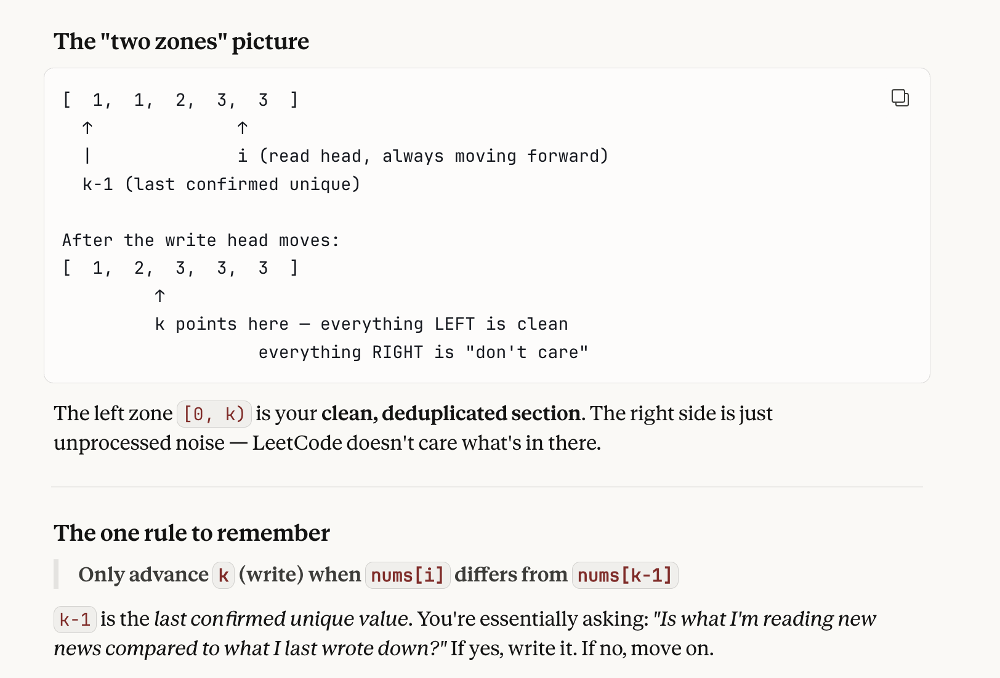

## Two-Pointer Problems

### 9. Palindrome Number (LeetCode)

- Naive --- convert num to string, concat to an empty string and compare new with original. Time: O(n). Space: O(1)

- **Two pointers approach**
    - check data type --> convert number to string for traversal (index, length properties of strings)
    - initialize 2 variables (e.g., left and right), start them at 0th and last (str.length - 1) indices
    - **while loop** to check for **mismatch**, in which case early return (false)
        - increment left and decrement right with each iteration
    - Time: O(n). Space: O(1)

```js
var isPalindrome = function(x) {
    let str = x.toString();

    let left = 0;
    let right = str.length - 1;

    while (left < right) {
        if (str[left] !== str[right]) {
            return false;
        }
        left++;
        right--;
    }
    return true;
};
```


### 26. Remove Duplicates from Sorted Array

- **HINT:** **sorted array** lends itself to two pointers, as the **dupcliate elems** will be adjacent, and you can simply skip dupes by moving a pointer.
- In LeetCode, this is worded weirdly (they want you to reassign elems / in-place moving of elems, and it sounds like they steering you towards returning the length of the sorted slice of the array---but you needn't even do that!)
- Output should be a **number (k)**, representing the unique elems. So have this double as your **counter** as you iterate
- Loop over nums:
    - compare current elem (`nums[i]`) and last seen unique elem (`nums[k - 1]`)
        - `i` is index of **current position** in loop
        - `k - 1` represents **index/position of the last unique elem**
    - when the `if` statement is **falsy** (i.e., there is a duplicate), then no re-writes/re-assignment; `i` just increments, `k` doesn't move
    - when the `if` statement is **true** (i.e., nums[i], the current value, is **not** the same as the last unique elem written), then a rewrite/reassignment occurs
        - `k` is the index/position of the **duplicate** of the last seen unique elem --- a.k.a, **where the writing will happen next once another unique elem is found**
        - `nums[k]` is the elem that gets written over with `nums[i]` (the unique elem found during the iteration)
            - i.e., in-place reassignment that maintains the ascending order of elems (per the prompt)
    - `k` gets **incremented by 1** --> this move the write head forward
        - so, after every iteration, the write head is in position to write the next unique elem

```js
var removeDuplicates = function(nums) {
    // initialize k --- counter of unique elems
    // think of k as the "write" head, used in the loop to re-assign dupes in place
    let k = 1;

    // iterate over nums
    // think of i as the "read" head, looking at every elem
    for (let i = 1; i < nums.length; i++) {
        if (nums[i] !== nums[k - 1]) {
            // read head (i) found something new, so write it where write head (k) is pointing
            nums[k] = nums[i];
            k += 1;
        }
    }
    return k;
};
```
- Pics for more explanation:




### 88. Merge Sorted Array

- **HINT** that it is a **two pointers** problem --> **sorted arrays**
    - lends itself to using pointers to compare two arrays/lists
    - most often, do so with a `while` loop
- **Strategy:** two pointers (?) with a while loop
    - **traverse** both arrays **from the ENDS**
        - end of nums1 --> m - 1
        - end of nums2 --> n - 1
        - current position you're writing in: nums1.length - 1
    - while looping, checking **last real elem (non-zero) of nums1** against **nums2**
        - whichever is bigger, write it in place to nums1 (per the prompt), and move that array's pointer
        - conditionals need to account for pointers at 0th index (include it) and not be negative 
- if nums2 has more elems, than nums1, finish writing into the earlier spots; if nums1 is greater, exits natrually and no extra writes needed  
- Time: O(n). Space: O(1).

```js
var merge = function(nums1, m, nums2, n) {
    // initialize pointers --- for each array and the write position for nums1 (the zeros, if they exist)
    let pointer1 = m - 1; // i.e., the last real element of nums1 (non-zero)
    let pointer2 = n - 1; // i.e., the last elem of nums1
    let writePos = nums1.length - 1 // i.e., the last elem of nums1 where writing will start; a.k.a, (m + n - 1)

    // loop --- will traverse over all of nums2
    // because nums1 has zeros as placeholders, there is space to write/write over elements
    while (pointer2 >= 0) {
        if (pointer1 >= 0 && nums1[pointer1] > nums2[pointer2]) {
            nums1[writePos] = nums1[pointer1];
            pointer1--;
        } else {
            nums1[writePos] = nums2[pointer2];
            pointer2--;
        }
        writePos--;
    }
    return nums1;
};
```